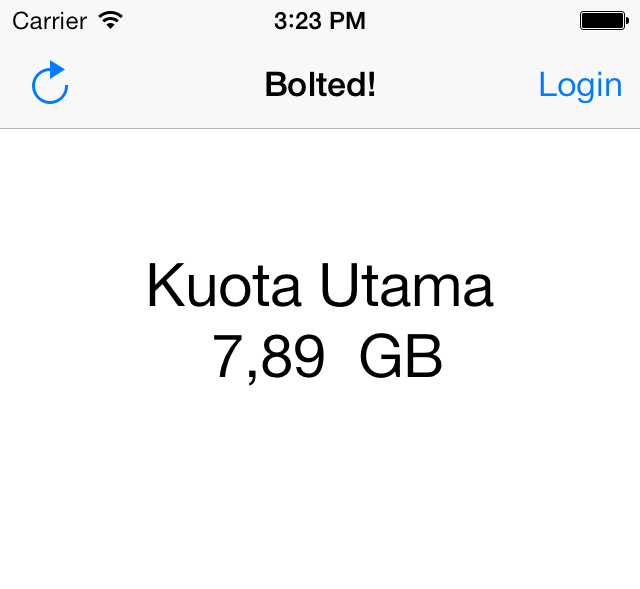

# Bolted!

A simple app to check the remaining usage quota on the new Indonesian 4G LTE wireless serviced named [Bolt!](http://www.boltsuper4g.com/)

The resulting project might not be useful for a lot of people, but I believe the source code is a great resource for new iOS developers. I myself would kept on referring on this project for things like;

1. Storing username and password on Keychain.
2. Sending POST request.
3. UITextField in UIAlertView.

Also, this is the app idea for my [one app a week](http://blog.soemarko.com/post/72193014899/2014-resolute) idea.

## License

This project is licensed under [DBAD License](http://www.dbad-license.org).